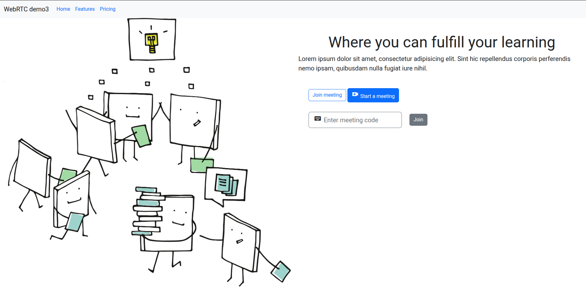
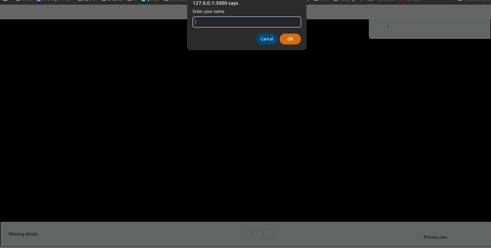
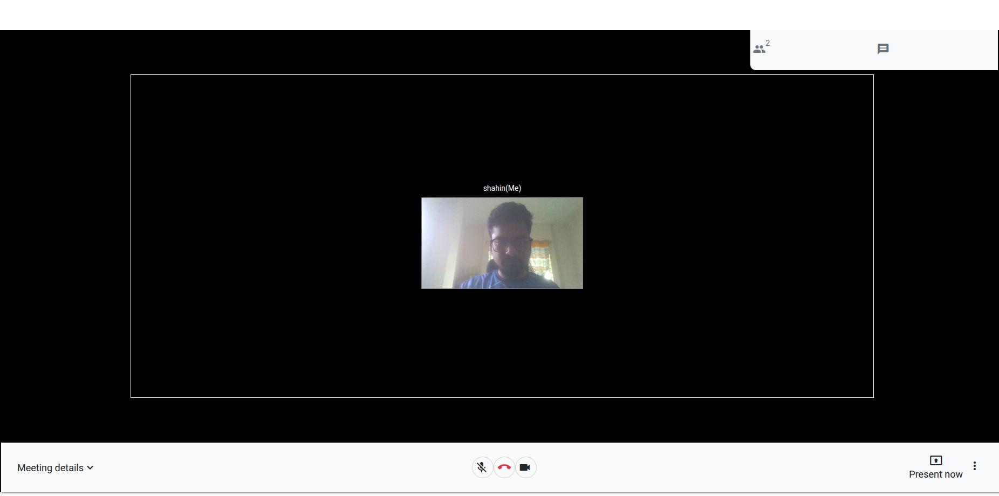
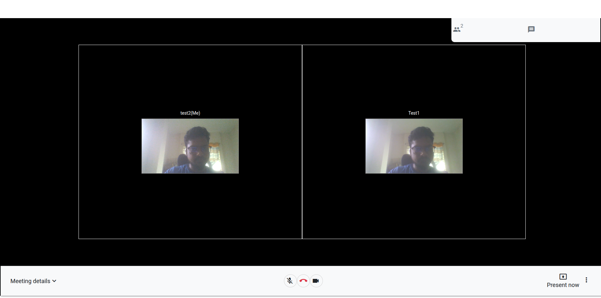

## How to run this

1. __Pull project from Git__
`git pull https://github.com/sudiptoshahin/webrtc-demo.git`

2. __Go to project directory__ 
`cd webrtc-demo`

3. __Install node packages__ 
`npm install`

4. __Run project__ 
`npm run start`

5. __Then Go to the following link__ [http://127.0.0.1:3000/entry](http://127.0.0.1:3000/entry)

6. __Enter you meeting ID(random number)__ and enter your name to join

7. __Enable the video by clicking the *video icon*__

__NB: *All features are may not be worked. i hope you'll overlook it kindly!*__
